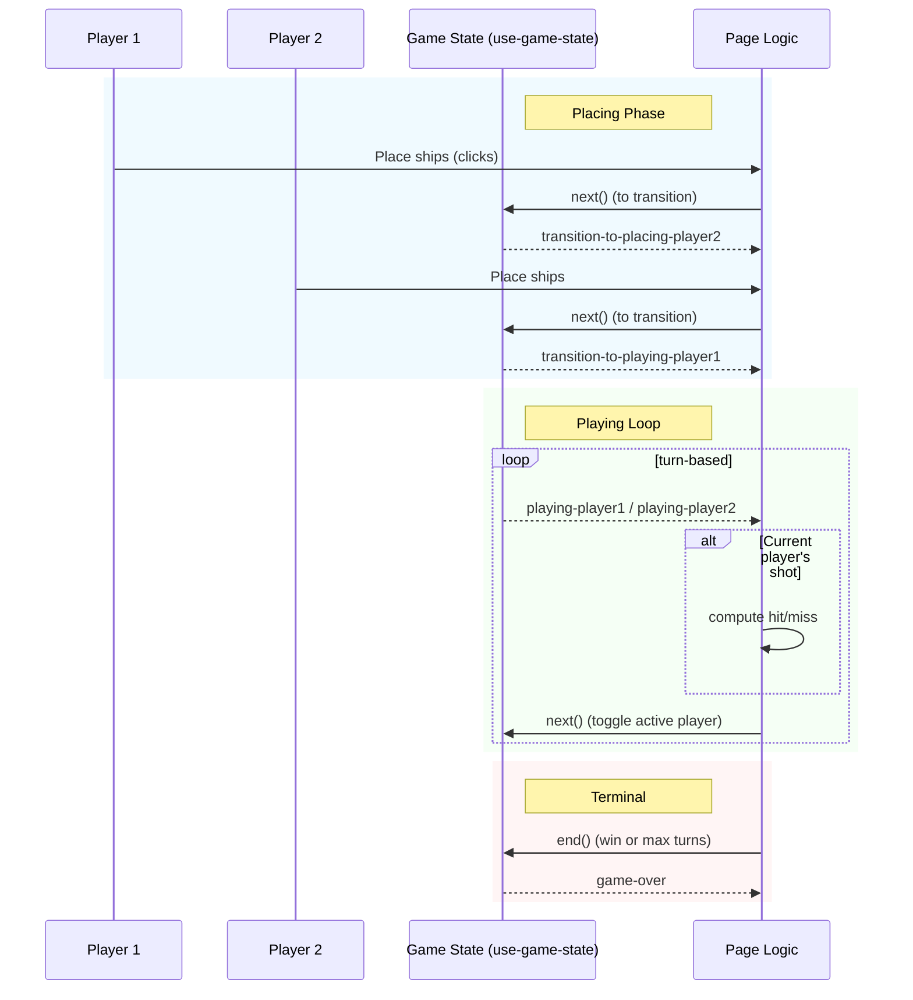

# gameplay states sequence

```mermaid
sequenceDiagram
  participant P1 as Player 1
  participant P2 as Player 2
  participant GS as Game State (use-game-state)
  participant Logic as Page Logic

  rect rgb(240,250,255)
    Note right of GS: Placing Phase
    P1->>Logic: Place ships (clicks)
    Logic->>GS: next() (to transition)
    GS-->>Logic: transition-to-placing-player2
    P2->>Logic: Place ships
    Logic->>GS: next() (to transition)
    GS-->>Logic: transition-to-playing-player1
  end

  rect rgb(245,255,245)
    Note right of GS: Playing Loop
    loop turn-based
      GS-->>Logic: playing-player1 / playing-player2
      alt Current player's shot
        Logic->>Logic: compute hit/miss
      end
      Logic->>GS: next() (toggle active player)
    end
  end

  rect rgb(255,245,245)
    Note right of GS: Terminal
    Logic->>GS: end() (win or max turns)
    GS-->>Logic: game-over
  end
```
