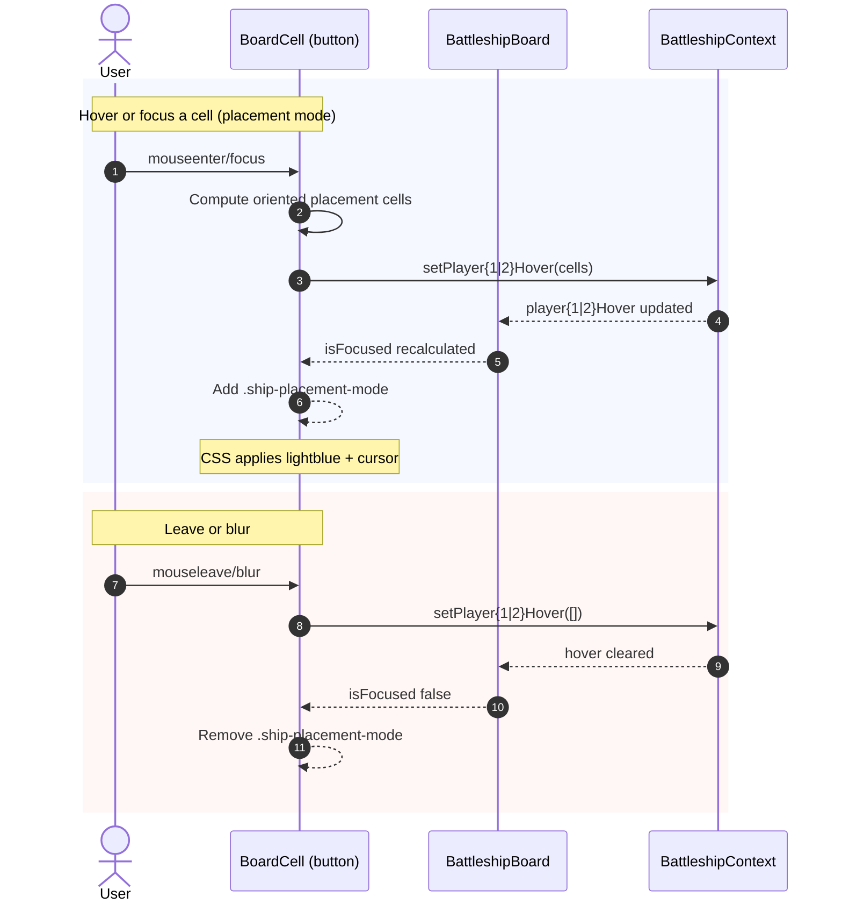

# hover placement diagram

```mermaid
sequenceDiagram
  autonumber
  actor U as User
  participant C as BoardCell (button)
  participant B as BattleshipBoard
  participant CTX as BattleshipContext

  rect rgb(245,248,255)
    note over U,C: Hover or focus a cell (placement mode)
    U->>C: mouseenter/focus
    C->>C: Compute oriented placement cells
    C->>CTX: setPlayer{1|2}Hover(cells)
    CTX-->>B: player{1|2}Hover updated
    B-->>C: isFocused recalculated
    C-->>C: Add .ship-placement-mode
    Note over C: CSS applies lightblue + cursor
  end

  rect rgb(255,247,245)
    note over U,C: Leave or blur
    U->>C: mouseleave/blur
    C->>CTX: setPlayer{1|2}Hover([])
    CTX-->>B: hover cleared
    B-->>C: isFocused false
    C-->>C: Remove .ship-placement-mode
  end

```
