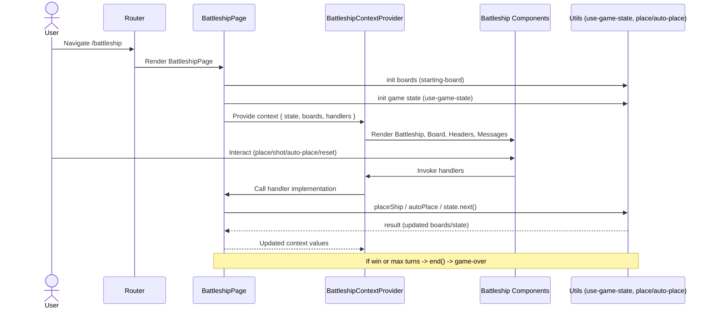

# battleship component sequence diagram

```mermaid
sequenceDiagram
  actor User
  participant Router as Router
  participant Page as BattleshipPage
  participant Ctx as BattleshipContextProvider
  participant UI as Battleship Components
  participant Utils as Utils (use-game-state, place/auto-place)

  User->>Router: Navigate /battleship
  Router->>Page: Render BattleshipPage
  Page->>Utils: init boards (starting-board)
  Page->>Utils: init game state (use-game-state)
  Page->>Ctx: Provide context { state, boards, handlers }
  Ctx->>UI: Render Battleship, Board, Headers, Messages
  User->>UI: Interact (place/shot/auto-place/reset)
  UI->>Ctx: Invoke handlers
  Ctx->>Page: Call handler implementation
  Page->>Utils: placeShip / autoPlace / state.next()
  Utils-->>Page: result (updated boards/state)
  Page-->>Ctx: Updated context values
  Note over Page,Utils: If win or max turns -> end() -> game-over
```
